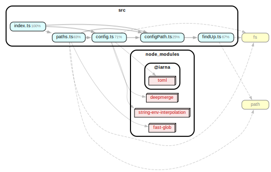
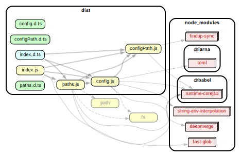

# Project Config

> **Warning**
>
> This is a new internal package. There are still changes we want to make, so we're marking it as experimental for now.
> **Don't depend on this directly in a Redwood project**.

This offers functionality to parse the Redwood configurations and a way to get a project's paths.

## The base directory

Redwood is anchored to a single `redwood.toml` file. We use this to determine the base directory of a project.

## Sides

Redwood separates your project into sides, by default we have a "web side" and an "api side." Each side has a target ("browser" for "web" and "node" for "api"). We use the concept of sides and targets to determine how to build, test, lint and manage your project.

## Dependency graphs

### src

### dist

