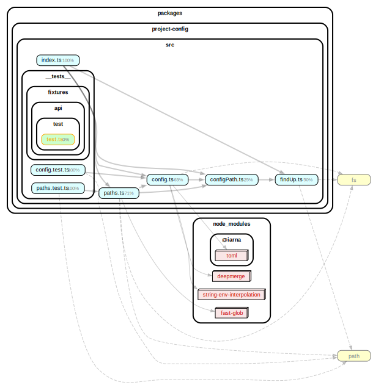
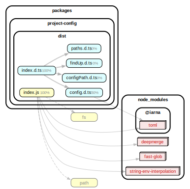

# Project Config

> **Warning**
>
> This is a new internal package. There are still changes we want to make, so we're marking it as experimental for now.
> **Don't depend on this directly in a Redwood project**.

This package offers functionality to parse Redwood's configuration file, redwood.toml, and a convenient way of getting a Redwood project's paths.

## Package size

| Version                                                                            | Publish | Install |
| :--------------------------------------------------------------------------------- | :------ | :------ |
| [v5.2.1](https://packagephobia.com/result?p=%40redwoodjs%2Fproject-config%405.2.1) | 96.6 kB | 809 kB  |

## Dependency graphs

### src

### dist

